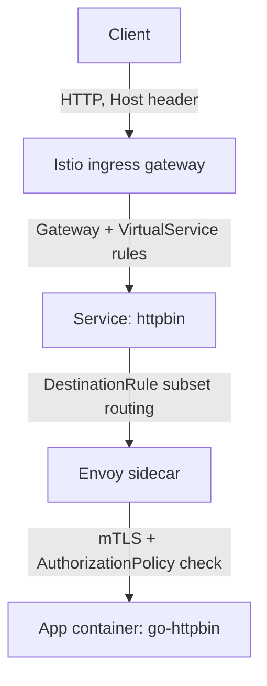

# Architecture

## Request flow

## Components

- **Istio ingress gateway** — single entry point for external traffic; matches `Gateway` resources by host/port
- **VirtualService** — routing rules: canary weights, fault injection
- **DestinationRule** — subsets (v1/v2) and connection policies
- **Envoy sidecar** — injected into every pod in the `demo` namespace; enforces mTLS and AuthorizationPolicy transparently
- **istiod** — control plane; distributes config and certificates to all Envoy proxies

## Security model

- `PeerAuthentication` (STRICT) — rejects any non-mTLS traffic to `httpbin`
- `AuthorizationPolicy` — explicit allow-list of SPIFFE identities permitted to reach `httpbin`; everything else gets `403`

## GitOps model

ArgoCD watches this repository and reconciles cluster state automatically
(`selfHeal: true`, `prune: true`). Manual `kubectl apply` is only used once,
to bootstrap each Application resource itself — all subsequent changes are
git push only.